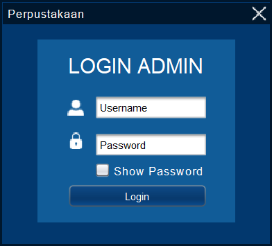
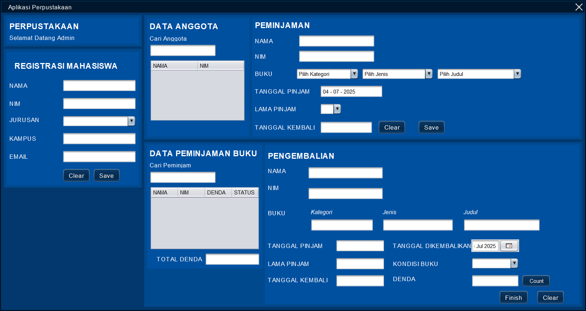

# 📚 perpustakaan-java-desktop

Aplikasi Manajemen Perpustakaan berbasis Java Desktop dengan GUI Swing, dibuat menggunakan Apache NetBeans. Mendukung login admin, CRUD data anggota, peminjaman, pengembalian, dan laporan sederhana.

---

## ✨ Fitur Utama

✅ Login Admin  
✅ Manajemen Anggota Perpustakaan (Tambah, Edit, Hapus)  
✅ Modul Peminjaman Buku  
✅ Modul Pengembalian Buku  
✅ Tabel Data Anggota dan Riwayat Peminjaman  
✅ Desain antarmuka user-friendly dengan Java Swing  
✅ Validasi input sederhana

---

## 🖼️ Tampilan Aplikasi

### Login


### Halaman Utama


---

## 🚀 Cara Menjalankan

1. Pastikan Java (JDK) sudah terinstal.
2. Buka proyek di **Apache NetBeans** (disarankan pakai versi yang mendukung Java Swing).
3. Pastikan dependensi berikut ada di folder `lib/`:
   - `jcalendar-1.4.jar`
   - `looks-2.4.1.jar`
4. Build & Run melalui NetBeans (`Run Project`) atau terminal:
   ```bash
   ant run
   
---

## 🔑 Login Admin

Login dengan akun admin default:

- **Username:** Admin  
- **Password:** Password

---

## 📚 Dependensi

- [JCalendar 1.4](https://toedter.com/jcalendar/)
- [JGoodies Looks 2.4.1](https://www.jgoodies.com/freeware/looks/)

---

## 🤝 Kontribusi

Kontribusi sangat terbuka! Fork repo ini dan buat pull request untuk perbaikan bug, peningkatan fitur, atau dokumentasi.

